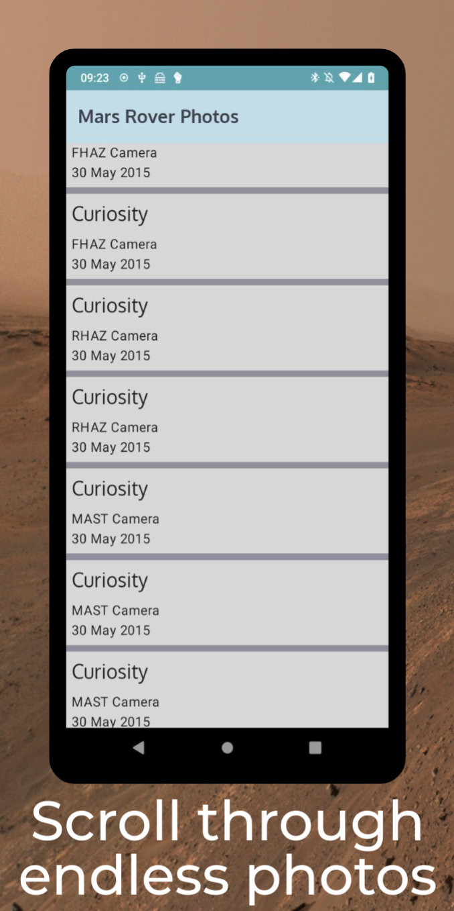
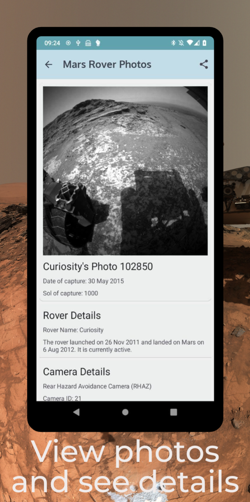
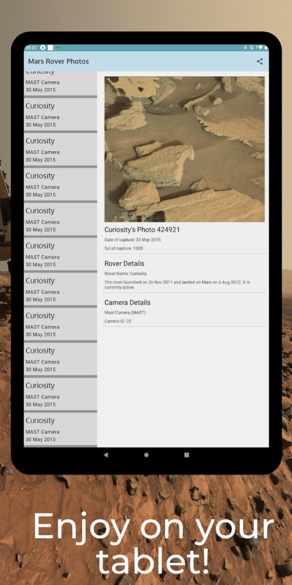
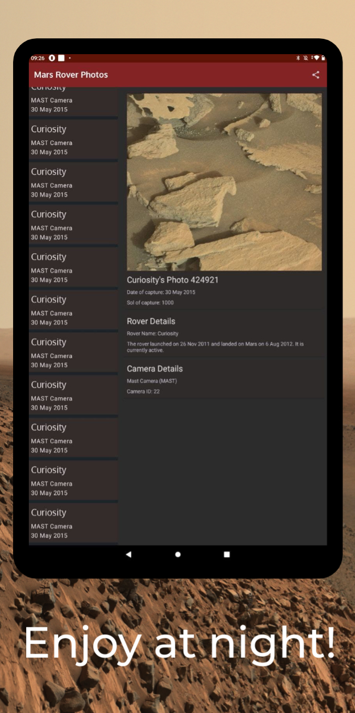
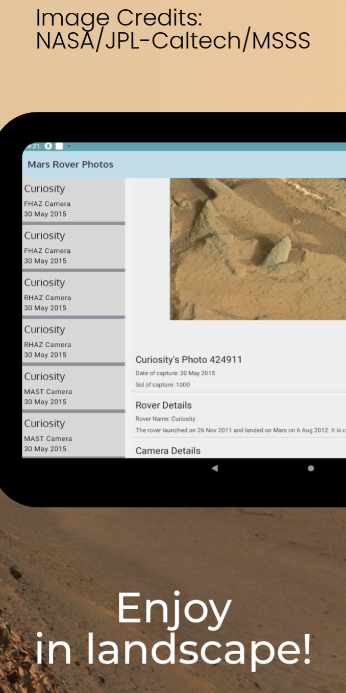

# Coding Challenge: Mars Rover Photo App

This app was written as part of an application process.
It shows a list of photos from the mars rover photo [API from NASA](https://api.nasa.gov/),
and allows sharing the photos's URL.

## Phone Screenshots
Photo List                 |  Photo Details
:-------------------------:|:-------------------------:
 |  

## Tablet Screenshots

Photos, Light Mode                 |  Photos, Dark Mode    |  Photo Details Landscape
:-------------------------:|:-------------------------:|:-------------------------:
 |   |  

## To be done
Of course, more things can always be done.

### Code
* better way to listen to updates from the paging adapter
* test the paging data flow. Flows are very simple for now, but will get more complicated with rover filtering.

### Features
* include photo in sharing intent
* add filtering option for the rover
* page not only over the pages of a single sol, but increase the sol parameter as well