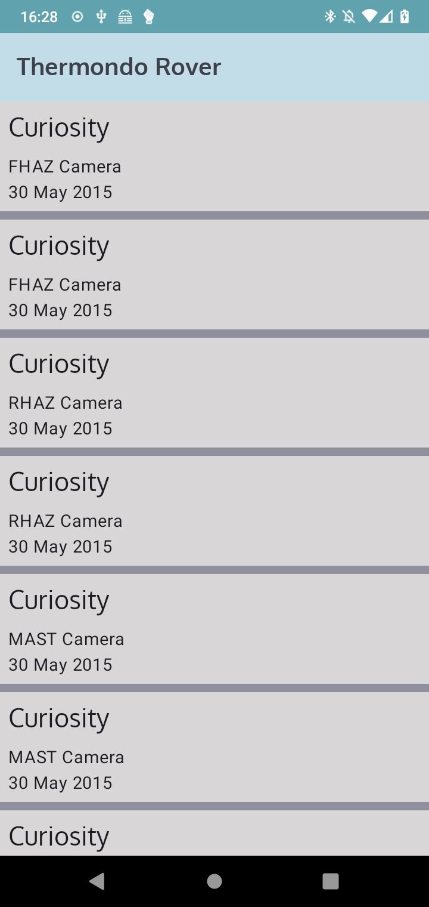
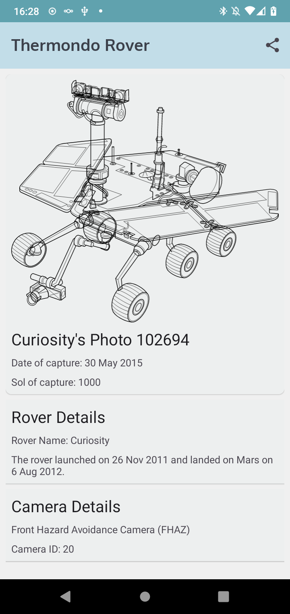
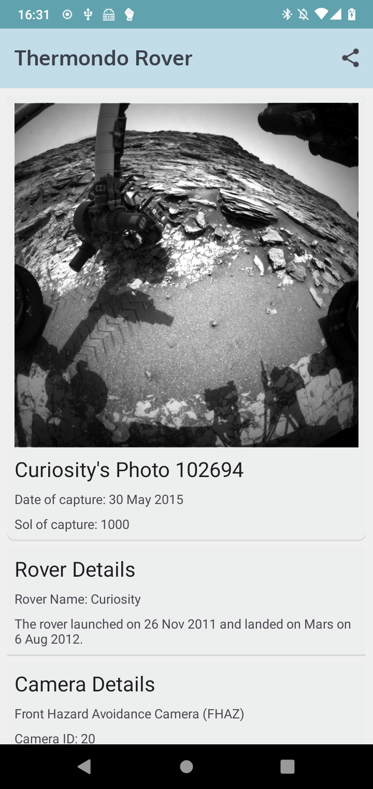

# Coding Challenge: Mars Rover Photo App

This app was written as part of an application process.
It shows a list of photos from the mars rover photo [API from NASA](https://api.nasa.gov/),
and allows sharing the photos's URL.

Photo List                 |  Photo Details Loading    |  Photo Details
:-------------------------:|:-------------------------:|:-------------------------:
 |   |  

